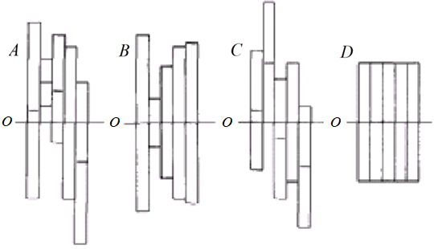

```{r, include=FALSE}
library(knitcitations)
library(stargazer)
```


Centralização e escalonamento de dados amostrais: Aplicação na Engenharia de Avaliações
================================================================================


[Autores]{.red}
================================================================================

Os autores deste trabalho são pesquisadores do Programa de Pós-Graduação em 
Gestão Territorial e Engenharia de Avaliações (PPGTG) da Universidade Federal de 
Santa Catarina (UFSC)

::: member-cards
## Luiz Fernando Palin Droubi


Autor principal.

É mestrando no PPGTG da UFSC e Engenheiro da (SPU/SC). É autor do `appraiseR`[@R-appraiseR], um pacote `R` para uso na
Engenharia de Avaliações.

## Norberto Hochheim


Professor Titular na UFSC. 

Atualmente é também Coordenador do Programa de Pós-Graduação em Gestão Territorial 
e Engenharia de Transportes da UFSC.

## Carlos Augusto Zilli


Professor da Unisul.

É mestrando no PPGTG da UFSC. Possui experiência na área de Matemática, com 
ênfase em Educação Matemática e em 
Avaliação de Imóveis, com ênfase em Inferência Estatística.

## Willian Zonato


Main author of **xaringan**

É mestrando no PPGTG da UFSC e Engenheiro da Secretaria do Patrimônio da União 
em Santa Catarina (SPU/SC).

:::

[As fotos são dos Currículos Lattes dos autores.Este poster foi criado com o 
auxílio do pacote R [**pagedown**](https://github.com/rstudio/pagedown).[@R-pagedown]]{.disclaimer}

[Centralização]{.blue}
================================================================================

A centralização dos dados amostrais corresponde à subtração da média amostral ou 
outro valor característico, aplicada a todos os dados, para cada variável da 
amostra. Matematicamente, isto pode ser representado na fórmula a seguir:

$$x_{ij} = x_{ij} - \bar{x_j} \qquad \forall i \in 1..n, j \in 1..p$$
onde:

* $x_{ij}$ é o valor observado para o dado amostral $i$ para a variável $j$;
* $\bar{x_j}$ é o valor da média amostral para a variável $j$;
* $n$ é o número de dados amostrais;
* $p$ é o número de parâmetros do modelo.


A figura 1 ilustra esse processo:


A centralização também pode ser feita em relação à outras características das 
variáveis. Quando feita em relação à média, as variáveis centralizadas ficam com 
média igual a zero. Isto pode ajudar na interpretação do modelo de regressão,
especialmente quando da presença de interação entre as variáveis. 

Quando feita em relação à valores referenciais que estas variáveis podem assumir, 
como os dados de um imóvel paradigma na Engenharia de Avaliações, o intercepto 
do modelo resulta significativo, pois este representará o valor da variável
dependente para a situação paradigma.


[Escalonamento]{.pink}
================================================================================

Normalmente as variáveis de determinada amostra são observadas em
escalas diferentes entre si. Neste caso, pode ser conveniente realizar um processo
chamado de escalonamento de variáveis. O tipo mais comum de escalonamento é o
de variância (*Variance Scaling*), muitas vezes chamado de padronização, o que está
ilustrado na figura 2.



Matematicamente, isto pode ser representado na fórmula a seguir:

$$x_{ij} = \frac{x_{ij} - \bar{x_j}}{\sigma_{x_j}} \qquad \forall i \in 1..n, j \in 1..p$$
onde:

* $\sigma_{x_j}$ é o valor do desvio-padrão amostral da variável $j$;

A padronização dos dados pode ser importante para reduzir a multicolinearidade
entre as variáveis independentes.

Além disto, a padronização dos dados amostrais pode reduzir significativamente
o erro computacional `r knitcitations::citep("10.1201/9781315119588")` devido 
ao arredondamento.

Além disto, se o objetivo do modelo é a predição de valores, o ideal é que se
mantenham o maior número de variáveis explicativas possíveis, adotando-se um 
*cutoff* maior para os p-valores, entre 0,25 e 0,35 [@Matloff_2017]. Como o 
escalonamento de variáveis pode reduzir os p-valores, mais variáveis
podem ser aproveitáveis para o modelo, melhorando o poder de predição do mesmo.

[Estudos de Casos]{.green}
================================================================================

Para exemplificar a utilização da centralização e do escalonamento de dados, foram
elaborados dois estudos de casos.

No primeiro caso,  em um loteamento com topografia variável, onde, além da 
centralização das variáveis em relação ao lote paradigma, a variável `inclinacao` 
foi padronizada (centralizada em zero e escalonada em relação ao seu desvio-padrão) 
para possibilitar a obtenção do grau I de Fundamentação da NBR-14.653-02. No 
segundo caso, num loteamento com diferentes regras de incorporação, foi 
aplicada novamente a centralização das variáveis em relação a um lote paradigma, 
com o escalonamento da variável Distância ao Mar.

## Loteamento com topografia variável

Para este caso, as variáveis foram centralizadas em relação a um lote paradigma
com características: plano, seco, com 15m de frente e 30m de profundidade. Além 
disto, os termos polinomiais da variável `inclinação` foram padronizados.

## Loteamento com diferentes regras de incorporação

Para este caso, as variáveis foram centralizadas em relação a um lote paradigma 
de 450m², com 15m de testada e viabilidade para 2 pavimentos. A distância ao mar
foi centralizada a 500m do mar, valor próximo à média amostral, além de ter sido
escalonada.

```{r, include=FALSE}
library(appraiseR)
data("loteamento")
loteamento$topo <- factor(loteamento$topo, 
                          levels = c("plano", "aclive", "declive"))
loteamento$pedologia <- factor(loteamento$pedologia, 
                               levels = c("seco", "pantanoso"))
loteamento$tipo <- factor(loteamento$tipo, 
                          levels = c("venda", "oferta"))
loteamento$inclinacao <- .01*loteamento$inclinacao
loteamento$valor[6] <- 44122.04
loteamento$valor[9] <- 21570.77
loteamento$valor[13] <- 19609.79
loteamento$VU <- with(loteamento, valor/area)
loteamento$VU <- ifelse(loteamento$tipo == "oferta", 
                        .9*loteamento$VU, 
                        loteamento$VU)
mean_incl <- mean(loteamento$inclinacao)
sd_incl <- sd(loteamento$inclinacao)
fit <- lm(VU ~ frente + profundidade + I(inclinacao^2) + I(inclinacao^3) +
            pedologia, data = loteamento, subset = -c(7, 19))
loteamento$frente <- as.vector(scale(loteamento$frente, 
                                     center = 15, scale = F))
loteamento$profundidade <- as.vector(scale(loteamento$profundidade, 
                                           center = 30, scale = F))
loteamento$inclinacao <- as.vector(scale(loteamento$inclinacao, 
                                           center = T, scale = T))
fit1 <- lm(VU ~ frente + profundidade + I(inclinacao^2) + I(inclinacao^3) +
            pedologia, data = loteamento, subset = -c(7, 19))
```

```{r, echo = FALSE, results='asis'}
stargazer(fit, fit1, header = FALSE, label = "tab:fits", type = "html", 
          style = "aer", font.size = "small",
          title = "Comparacão dos modelos com e sem centralização e escalonamento.",
          decimal.mark = ",", digit.separator = ".", 
          intercept.bottom = FALSE, intercept.top = TRUE, single.row = TRUE,
          report = "vcs*", star.cutoffs = c(0.30, 0.20, 0.10))
```

```{r, include = FALSE}
jurere <- readxl::read_excel("../jurere.xls")

mean_dist_mar <- mean(jurere$DIST_MAR)
sd_dist_mar <- sd(jurere$DIST_MAR)
jurere$PROFUNDIDADE <- with(jurere, AREA/TESTADA)
jurere$PAVIMENTOS <- as.factor(jurere$PAVIMENTOS)
fit <- lm(VU ~  I(AREA^2) + TESTADA + DIST_MAR + PAVIMENTOS, 
          data = jurere, subset = -27)
jurere$AREA <- as.vector(scale(jurere$AREA, center = 450, scale = FALSE))
jurere$TESTADA <- as.vector(scale(jurere$TESTADA, center = 15, scale = FALSE))
jurere$PROFUNDIDADE <- as.vector(scale(jurere$PROFUNDIDADE, center = 30, scale = FALSE))
jurere$DIST_MAR <- as.vector(scale(jurere$DIST_MAR, center = TRUE, scale = TRUE))
fit1 <- lm(VU ~  I(AREA^2) + TESTADA + DIST_MAR + PAVIMENTOS, 
          data = jurere, subset = -27)
```

```{r, echo = FALSE, results='asis'}
stargazer(fit, fit1, header = FALSE, label = "tab:fits", type = "html", 
          style = "aer", font.size = "small",
          title = "Comparacão dos modelos com e sem centralização e escalonamento. Jurerê Internacional (2017).",
          decimal.mark = ",", digit.separator = ".", 
          intercept.bottom = FALSE, intercept.top = TRUE, single.row = TRUE,
          report = "vcs*", star.cutoffs = c(0.30, 0.20, 0.10))
```


[Referências]{.yellow}
================================================================================

```{r, include=FALSE}
write.bibtex(file="references.bib")
knitr::write_bib(c('pagedown', 'appraiseR'), 'packages.bib')
```
