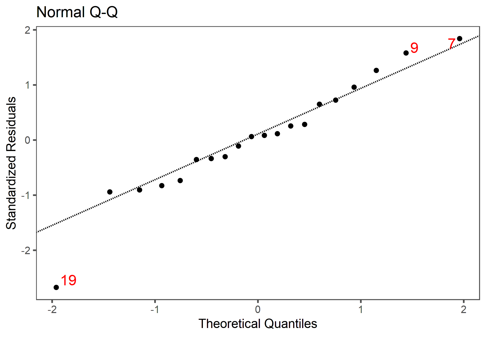
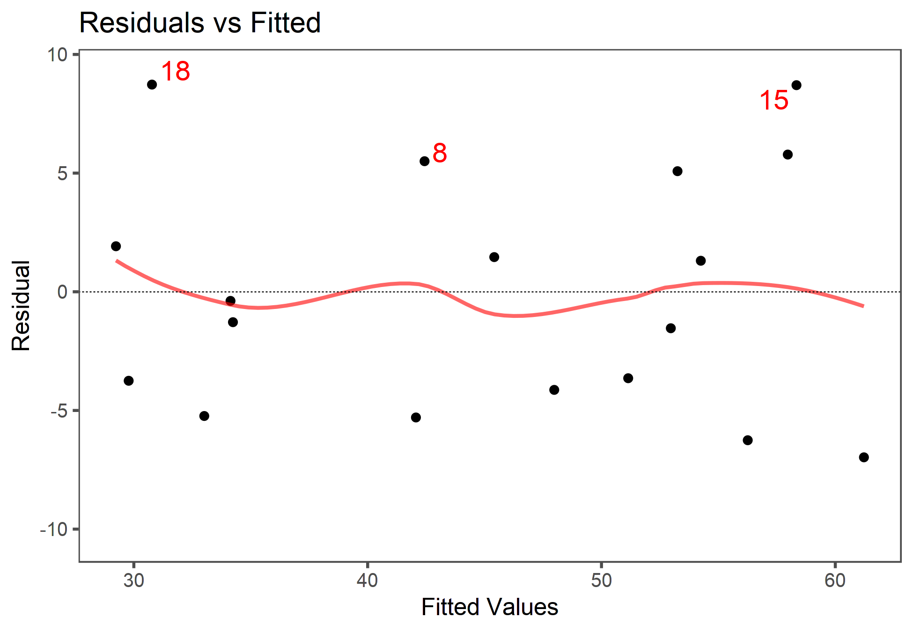
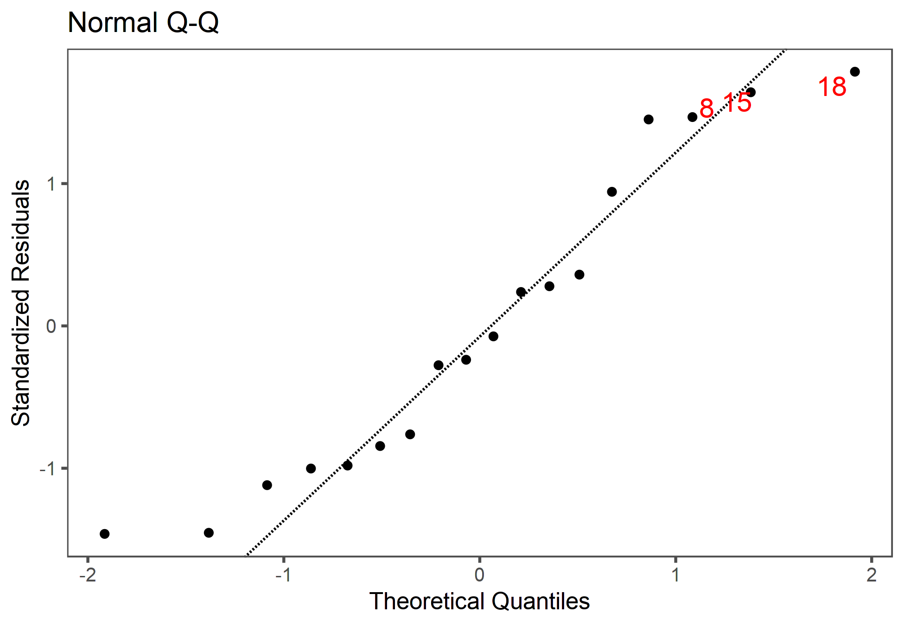

## Dados

Para este estudo de caso foram utilizados os dados disponíveis em Hochheim (xxxx).


```r
dfSummary(loteamento, plain.ascii = FALSE, style = "grid", 
          graph.magnif = 0.75, valid.col = FALSE, tmp.img.dir = "/tmp")
```

```
## 'tmp.img.dir' will be ignored since system has no X11 capabilities
```

### Data Frame Summary  
#### loteamento  
**Dimensions:** 20 x 9  
**Duplicates:** 0  

+----+---------------+-------------------------------+--------------------+-----------------------+---------+
| No | Variable      | Stats / Values                | Freqs (% of Valid) | Graph                 | Missing |
+====+===============+===============================+====================+=======================+=========+
| 1  | valor\        | Mean (sd) : 25415.1 (8065.6)\ | 16 distinct values | \                     | 0\      |
|    | [numeric]     | min < med < max:\             |                    | \ \ \ \ : :\          | (0%)    |
|    |               | 12500 < 25000 < 44122\        |                    | \ \ : : :\            |         |
|    |               | IQR (CV) : 10167.7 (0.3)      |                    | \ \ : : :\            |         |
|    |               |                               |                    | : : : : :\            |         |
|    |               |                               |                    | : : : : : : :         |         |
+----+---------------+-------------------------------+--------------------+-----------------------+---------+
| 2  | area\         | Mean (sd) : 562.2 (214)\      | 16 distinct values | \                     | 0\      |
|    | [numeric]     | min < med < max:\             |                    | \ \ :\                | (0%)    |
|    |               | 360 < 493 < 1200\             |                    | \ \ : :\              |         |
|    |               | IQR (CV) : 113.8 (0.4)        |                    | \ \ : :\              |         |
|    |               |                               |                    | \ \ : :\              |         |
|    |               |                               |                    | : : : . \ \ . \ \ . . |         |
+----+---------------+-------------------------------+--------------------+-----------------------+---------+
| 3  | tipo\         | 1\. venda\                    | 11 (55.0%)\        | IIIIIIIIIII \         | 0\      |
|    | [factor]      | 2\. oferta                    | 9 (45.0%)          | IIIIIIIII             | (0%)    |
+----+---------------+-------------------------------+--------------------+-----------------------+---------+
| 4  | frente\       | Mean (sd) : 15.8 (3.2)\       | 10 : 1 ( 5.0%)\    | I \                   | 0\      |
|    | [numeric]     | min < med < max:\             | 12 : 2 (10.0%)\    | II \                  | (0%)    |
|    |               | 10 < 15 < 22\                 | 13 : 2 (10.0%)\    | II \                  |         |
|    |               | IQR (CV) : 4.2 (0.2)          | 14 : 1 ( 5.0%)\    | I \                   |         |
|    |               |                               | 15 : 5 (25.0%)\    | IIIII \               |         |
|    |               |                               | 16 : 1 ( 5.0%)\    | I \                   |         |
|    |               |                               | 17 : 2 (10.0%)\    | II \                  |         |
|    |               |                               | 18 : 2 (10.0%)\    | II \                  |         |
|    |               |                               | 20 : 3 (15.0%)\    | III \                 |         |
|    |               |                               | 22 : 1 ( 5.0%)     | I                     |         |
+----+---------------+-------------------------------+--------------------+-----------------------+---------+
| 5  | profundidade\ | Mean (sd) : 39 (11.3)\        | 30 : 8 (40.0%)\    | IIIIIIII \            | 0\      |
|    | [numeric]     | min < med < max:\             | 35 : 5 (25.0%)\    | IIIII \               | (0%)    |
|    |               | 30 < 35 < 60\                 | 40 : 2 (10.0%)\    | II \                  |         |
|    |               | IQR (CV) : 12.5 (0.3)         | 50 : 1 ( 5.0%)\    | I \                   |         |
|    |               |                               | 55 : 1 ( 5.0%)\    | I \                   |         |
|    |               |                               | 60 : 3 (15.0%)     | III                   |         |
+----+---------------+-------------------------------+--------------------+-----------------------+---------+
| 6  | topo\         | 1\. plano\                    | 8 (40.0%)\         | IIIIIIII \            | 0\      |
|    | [factor]      | 2\. aclive\                   | 6 (30.0%)\         | IIIIII \              | (0%)    |
|    |               | 3\. declive                   | 6 (30.0%)          | IIIIII                |         |
+----+---------------+-------------------------------+--------------------+-----------------------+---------+
| 7  | inclinacao\   | Mean (sd) : 1 (9)\            | 11 distinct values | \                     | 0\      |
|    | [numeric]     | min < med < max:\             |                    | \ \ \ \ :\            | (0%)    |
|    |               | -15 < 0 < 18\                 |                    | \ \ \ \ :\            |         |
|    |               | IQR (CV) : 7.5 (9.5)          |                    | \ \ \ \ :\            |         |
|    |               |                               |                    | . \ \ :\              |         |
|    |               |                               |                    | : . : . : . :         |         |
+----+---------------+-------------------------------+--------------------+-----------------------+---------+
| 8  | pedologia\    | 1\. seco\                     | 14 (70.0%)\        | IIIIIIIIIIIIII \      | 0\      |
|    | [factor]      | 2\. pantanoso                 | 6 (30.0%)          | IIIIII                | (0%)    |
+----+---------------+-------------------------------+--------------------+-----------------------+---------+
| 9  | VU\           | Mean (sd) : 45.2 (13.3)\      | 20 distinct values | \                     | 0\      |
|    | [numeric]     | min < med < max:\             |                    | \ \ : :\              | (0%)    |
|    |               | 23.8 < 47.2 < 67\             |                    | \ \ : : :\            |         |
|    |               | IQR (CV) : 21 (0.3)           |                    | : : : : :\            |         |
|    |               |                               |                    | : : : : :\            |         |
|    |               |                               |                    | : : : : :             |         |
+----+---------------+-------------------------------+--------------------+-----------------------+---------+


## Modelo inicial

De posse de todos os dados, sem qualquer transformação exceto a da variável `inclinacao`, por construção, foi primeiramente ajustado o modelo primeiramente proposto, desprezando-se a variável `area` e fazendo uso das variáveis `frente` e `profundidade`.


```r
fit <- lm(VU ~ frente + profundidade + I(inclinacao^2) +
            pedologia, data = loteamento)
mplot(fit, which = 1:6)
```

<div class="figure" style="text-align: center">

<p class="caption">Modelo com todos os dados</p>
</div>

Os pontos 7 e 19 foram excluídos do modelo.


```r
fit <- update(fit, subset = -c(7, 19))
```


## Centralização dos dados

Para contornar este problema, utilizamos a técnica de centralizar as variáveis na sua escala


```r
loteamento$frente <- as.vector(scale(loteamento$frente, center = 15, scale = F))
loteamento$profundidade <- as.vector(scale(loteamento$profundidade, center = 30, scale = F))
```


```r
fit1 <- lm(VU ~ frente + profundidade + I(inclinacao^2) + 
            pedologia, data = loteamento, subset = -c(7, 19))
mplot(fit1, which = 1:6)
```

<div class="figure" style="text-align: center">

<p class="caption">Modelo saneado</p>
</div>


```r
stargazer(fit, fit1, header = FALSE, 
          title = "Comparacão dos modelos com e sem centralização",
          ci = TRUE, ci.level = 0.80, decimal.mark = ",", digit.separator = ".",
          report = "vctp*", star.cutoffs = c(0.30, 0.20, 0.10))
```


\begin{table}[!htbp] \centering 
  \caption{Comparacão dos modelos com e sem centralização} 
  \label{} 
\begin{tabular}{@{\extracolsep{5pt}}lcc} 
\\[-1.8ex]\hline 
\hline \\[-1.8ex] 
 & \multicolumn{2}{c}{\textit{Dependent variable:}} \\ 
\cline{2-3} 
\\[-1.8ex] & \multicolumn{2}{c}{VU} \\ 
\\[-1.8ex] & (1) & (2)\\ 
\hline \\[-1.8ex] 
 frente & 0,902 & 0,902 \\ 
  & t = 1,728 & t = 1,728 \\ 
  & p = 0,108$^{**}$ & p = 0,108$^{**}$ \\ 
  & & \\ 
 profundidade & $-$0,214 & $-$0,214 \\ 
  & t = $-$1,440 & t = $-$1,440 \\ 
  & p = 0,174$^{**}$ & p = 0,174$^{**}$ \\ 
  & & \\ 
 I(inclinacao$\hat{\mkern6mu}$2) & $-$0,028 & $-$0,028 \\ 
  & t = $-$1,796 & t = $-$1,796 \\ 
  & p = 0,096$^{***}$ & p = 0,096$^{***}$ \\ 
  & & \\ 
 pedologiapantanoso & $-$21,570 & $-$21,570 \\ 
  & t = $-$5,605 & t = $-$5,605 \\ 
  & p = 0,0001$^{***}$ & p = 0,0001$^{***}$ \\ 
  & & \\ 
 Constant & 48,140 & 55,244 \\ 
  & t = 5,135 & t = 21,157 \\ 
  & p = 0,0002$^{***}$ & p = 0,000$^{***}$ \\ 
  & & \\ 
\hline \\[-1.8ex] 
Observations & 18 & 18 \\ 
R$^{2}$ & 0,797 & 0,797 \\ 
Adjusted R$^{2}$ & 0,734 & 0,734 \\ 
Residual Std. Error (df = 13) & 6,267 & 6,267 \\ 
F Statistic (df = 4; 13) & 12,757$^{***}$ & 12,757$^{***}$ \\ 
\hline 
\hline \\[-1.8ex] 
\textit{Note:}  & \multicolumn{2}{r}{$^{*}$p$<$0,3; $^{**}$p$<$0,2; $^{***}$p$<$0,1} \\ 
\end{tabular} 
\end{table} 

A tabela \ref{tab:tabela} mostra a tabela dos dados amostrais, com o acréscimo dos valores ajustados.


```r
loteamento$yhat <- predict(fit1, newdata = loteamento)
loteamento$frente <- loteamento$frente + 15
loteamento$profundidade <- loteamento$profundidade + 30
kable(loteamento, digits = 2, 
      format.args = list(big.mark = ".", decimal.mark = ","), booktabs = TRUE,
      caption = "Dados do modelo com  valores ajustados.")
```


Table: Dados do modelo com  valores ajustados.

     valor    area  tipo      frente   profundidade  topo       inclinacao  pedologia       VU    yhat
----------  ------  -------  -------  -------------  --------  -----------  ----------  ------  ------
 25.000,00     450  venda         15             30  plano               0  seco         55,56   55,24
 30.000,00     525  oferta        15             35  aclive              5  seco         51,43   53,47
 28.500,00     650  venda         13             50  declive            -8  seco         43,85   47,36
 29.500,00   1.020  oferta        17             60  plano               0  pantanoso    26,03   29,06
 19.000,00     360  oferta        12             30  declive           -15  seco         47,50   46,21
 44.122,04   1.200  venda         20             60  aclive             18  seco         36,77   44,21
 40.000,00     550  oferta        10             55  declive           -10  seco         65,45   42,57
 18.000,00     520  oferta        13             40  declive            -2  pantanoso    31,15   29,62
 21.570,77     450  venda         15             30  aclive             18  seco         47,94   46,13
 23.000,00     414  oferta        18             30  aclive              7  seco         50,00   56,57
 25.500,00     400  venda         20             35  declive           -14  seco         63,75   53,17
 12.500,00     450  venda         15             30  declive            -2  pantanoso    27,78   33,56
 19.609,79     595  venda         17             35  plano               0  pantanoso    32,96   34,41
 30.500,00     506  oferta        22             30  plano               0  seco         54,25   61,56
 25.000,00     480  oferta        12             40  aclive             12  seco         46,88   46,35
 29.500,00     440  venda         20             35  plano               0  seco         67,05   58,68
 24.500,00     420  venda         14             30  plano               0  seco         58,33   54,34
 18.000,00     480  oferta        16             30  plano               0  pantanoso    33,75   34,58
 12.500,00     525  venda         15             35  aclive             10  seco         23,81   51,36
 32.000,00     810  venda         18             60  plano               0  pantanoso    39,51   29,96

A figura \ref{fig:pplot} mostra o gráfico do poder de predição do modelo.


```r
power_plot(fit1)
```

<div class="figure" style="text-align: center">

<p class="caption">Poder de predição do modelo.</p>
</div>


## Coerência do modelo

O modelo é coerente, conforme pode-se notar nas estimativas abaixo:

### Paradigma


```r
p <- predict(fit1,
             newdata = data.frame(frente = (15 - 15), profundidade = (30 - 30), 
                                  inclinacao = 0, pedologia = as.factor("seco")
                                  )
             )
p
```

```
##        1 
## 55.24417
```

### Mais frente

Acrescenta-se 0,90 por metro adicional ao da frente do lote paradigma.


```r
p <- predict(fit1,
             newdata = data.frame(frente = (20 - 15), profundidade = (30 - 30), 
                                  inclinacao = 0, pedologia = as.factor("seco")
                                  )
             )
p
```

```
##        1 
## 59.75304
```


### Mais profundidade

Diminui-se -0,21 por metro adicional ao da profundidade do lote paradigma.


```r
p <- predict(fit1,
             newdata = data.frame(frente = (15 - 15), profundidade = (45 - 30), 
                                  inclinacao = 0, pedologia = as.factor("seco")
                                  )
             )
p
```

```
##        1 
## 52.03317
```

### Mais frente e mais profundidade


```r
p <- predict(fit1,
             newdata = data.frame(frente = (20 - 15), profundidade = (40 - 30), 
                                  inclinacao = 0, pedologia = as.factor("seco")
                                  )
             )
p
```

```
##        1 
## 57.61237
```

### Declive


```r
p <- predict(fit1,
             newdata = data.frame(frente = (15 - 15), profundidade = (30 - 30), 
                                  inclinacao = -10, pedologia = as.factor("seco")
                                  )
             )
p
```

```
##        1 
## 52.43019
```


### Aclive


```r
p <- predict(fit1,
             newdata = data.frame(frente = (15 - 15), profundidade = (30 - 30), 
                                  inclinacao = 10, pedologia = as.factor("seco")
                                  )
             )
p
```

```
##        1 
## 52.43019
```

### Pantanoso


```r
p <- predict(fit1,
             newdata = data.frame(frente = (15 - 15), profundidade = (30 - 30), 
                                  inclinacao = 0, pedologia = as.factor("pantanoso")
                                  )
             )
p
```

```
##        1 
## 33.67406
```

## Estimativas

### Terreno 1


```r
p1 <- 14*40*predict(fit1, 
                    newdata = data.frame(frente = (14 - 15), profundidade = (40 - 30), 
                                         inclinacao = .08, pedologia = as.factor("seco")),
                    interval = "confidence", level = 0.80)
```


```r
p1
```

```
##        fit      lwr      upr
## 1 29232.87 26903.95 31561.78
```

```r
amplitude(p1)
```

```
##     1 
## 15.93
```

### Terreno 2


```r
p2 <- 16*50*predict(fit1, 
                    newdata = data.frame(frente = (16 - 15), profundidade = (50 - 30), 
                                         inclinacao = -.15, pedologia = as.factor("seco")), 
                    interval = "confidence", level = 0.80)
```


```r
p2
```

```
##        fit      lwr      upr
## 1 41491.18 37617.77 45364.59
```

```r
amplitude(p2)
```

```
##     1 
## 18.67
```

# CONCLUSÃO

O modelo com os dados centralizados possibilitou uma melhor interpretação do modelo, haja vista que o intercepto do modelo é o valor do metro quadrado do lote paradigma.
