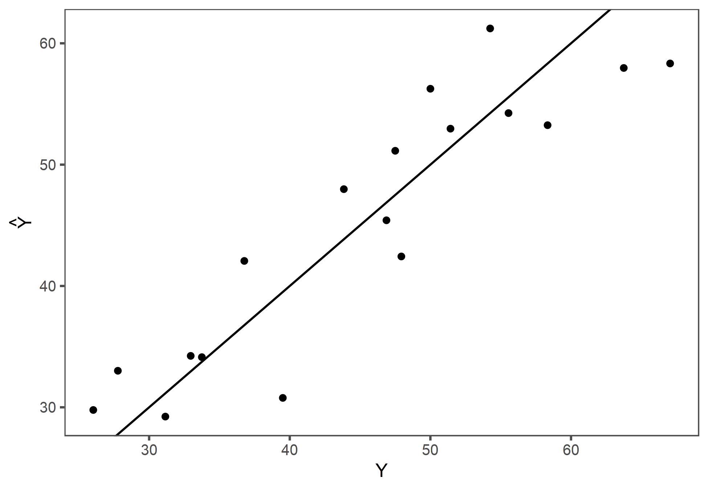

# ESTUDO DE CASO

## Dados

Para este estudo de caso foram utilizados os dados disponíveis em Hochheim [-@hochheim2005, 74].

### Data Frame Summary  
#### loteamento  
**Dimensions:** 20 x 9  
**Duplicates:** 0  

+----+---------------+-------------------------------+--------------------+-----------------------+---------+
| No | Variable      | Stats / Values                | Freqs (% of Valid) | Graph                 | Missing |
+====+===============+===============================+====================+=======================+=========+
| 1  | valor\        | Mean (sd) : 25415.1 (8065.6)\ | 16 distinct values | \                     | 0\      |
|    | [numeric]     | min < med < max:\             |                    | \ \ \ \ : :\          | (0%)    |
|    |               | 12500 < 25000 < 44122\        |                    | \ \ : : :\            |         |
|    |               | IQR (CV) : 10167.7 (0.3)      |                    | \ \ : : :\            |         |
|    |               |                               |                    | : : : : :\            |         |
|    |               |                               |                    | : : : : : : :         |         |
+----+---------------+-------------------------------+--------------------+-----------------------+---------+
| 2  | area\         | Mean (sd) : 562.2 (214)\      | 16 distinct values | \                     | 0\      |
|    | [numeric]     | min < med < max:\             |                    | \ \ :\                | (0%)    |
|    |               | 360 < 493 < 1200\             |                    | \ \ : :\              |         |
|    |               | IQR (CV) : 113.8 (0.4)        |                    | \ \ : :\              |         |
|    |               |                               |                    | \ \ : :\              |         |
|    |               |                               |                    | : : : . \ \ . \ \ . . |         |
+----+---------------+-------------------------------+--------------------+-----------------------+---------+
| 3  | tipo\         | 1\. venda\                    | 11 (55.0%)\        | IIIIIIIIIII \         | 0\      |
|    | [factor]      | 2\. oferta                    | 9 (45.0%)          | IIIIIIIII             | (0%)    |
+----+---------------+-------------------------------+--------------------+-----------------------+---------+
| 4  | frente\       | Mean (sd) : 15.8 (3.2)\       | 10 : 1 ( 5.0%)\    | I \                   | 0\      |
|    | [numeric]     | min < med < max:\             | 12 : 2 (10.0%)\    | II \                  | (0%)    |
|    |               | 10 < 15 < 22\                 | 13 : 2 (10.0%)\    | II \                  |         |
|    |               | IQR (CV) : 4.2 (0.2)          | 14 : 1 ( 5.0%)\    | I \                   |         |
|    |               |                               | 15 : 5 (25.0%)\    | IIIII \               |         |
|    |               |                               | 16 : 1 ( 5.0%)\    | I \                   |         |
|    |               |                               | 17 : 2 (10.0%)\    | II \                  |         |
|    |               |                               | 18 : 2 (10.0%)\    | II \                  |         |
|    |               |                               | 20 : 3 (15.0%)\    | III \                 |         |
|    |               |                               | 22 : 1 ( 5.0%)     | I                     |         |
+----+---------------+-------------------------------+--------------------+-----------------------+---------+
| 5  | profundidade\ | Mean (sd) : 39 (11.3)\        | 30 : 8 (40.0%)\    | IIIIIIII \            | 0\      |
|    | [numeric]     | min < med < max:\             | 35 : 5 (25.0%)\    | IIIII \               | (0%)    |
|    |               | 30 < 35 < 60\                 | 40 : 2 (10.0%)\    | II \                  |         |
|    |               | IQR (CV) : 12.5 (0.3)         | 50 : 1 ( 5.0%)\    | I \                   |         |
|    |               |                               | 55 : 1 ( 5.0%)\    | I \                   |         |
|    |               |                               | 60 : 3 (15.0%)     | III                   |         |
+----+---------------+-------------------------------+--------------------+-----------------------+---------+
| 6  | topo\         | 1\. plano\                    | 8 (40.0%)\         | IIIIIIII \            | 0\      |
|    | [factor]      | 2\. aclive\                   | 6 (30.0%)\         | IIIIII \              | (0%)    |
|    |               | 3\. declive                   | 6 (30.0%)          | IIIIII                |         |
+----+---------------+-------------------------------+--------------------+-----------------------+---------+
| 7  | inclinacao\   | Mean (sd) : 1 (9)\            | 11 distinct values | \                     | 0\      |
|    | [numeric]     | min < med < max:\             |                    | \ \ \ \ :\            | (0%)    |
|    |               | -15 < 0 < 18\                 |                    | \ \ \ \ :\            |         |
|    |               | IQR (CV) : 7.5 (9.5)          |                    | \ \ \ \ :\            |         |
|    |               |                               |                    | . \ \ :\              |         |
|    |               |                               |                    | : . : . : . :         |         |
+----+---------------+-------------------------------+--------------------+-----------------------+---------+
| 8  | pedologia\    | 1\. seco\                     | 14 (70.0%)\        | IIIIIIIIIIIIII \      | 0\      |
|    | [factor]      | 2\. pantanoso                 | 6 (30.0%)          | IIIIII                | (0%)    |
+----+---------------+-------------------------------+--------------------+-----------------------+---------+
| 9  | VU\           | Mean (sd) : 45.2 (13.3)\      | 20 distinct values | \                     | 0\      |
|    | [numeric]     | min < med < max:\             |                    | \ \ : :\              | (0%)    |
|    |               | 23.8 < 47.2 < 67\             |                    | \ \ : : :\            |         |
|    |               | IQR (CV) : 21 (0.3)           |                    | : : : : :\            |         |
|    |               |                               |                    | : : : : :\            |         |
|    |               |                               |                    | : : : : :             |         |
+----+---------------+-------------------------------+--------------------+-----------------------+---------+

## Modelo inicial

Para a modelagem correta da variável `inclinacao`, devem ser modelados os termos quadrático e cúbico da variável, o que possibilita que os efeitos do aclive e do declive tenham magnitudes diferentes. O termo linear da variável `inclinacao` não apresentou significância.

De posse de todos os dados, sem qualquer transformação exceto a da variável `inclinacao`, por construção, foi primeiramente ajustado um primeiro modelo, apenas para o saneamento da amostra, em que foram utilizadas as variáveis `frente` e `profundidade` em detrimento da variável `area`.

Os gráficos diagnósticos deste primeiro modelo podem ser vistos na figura \ref{fig:fit}.

Modelo com todos os dados

Como se pode notar na figura \ref{fig:fit}, os pontos 7 e 19 encontram-se bem afastados da média e foram excluídos do modelo final.

Segundo Hochheim, [-@hochheim2005, 74], o paradigma da região é um terreno plano e seco, com 15m de frente e 30m de profundidade.

Uma vez obtido o modelo final saneado, então, foi ajustado outro modelo, onde adotou-se a centralização das variáveis `frente` e `profundidade`, de acordo com o lote paradigma. Já a variável `inclinacao`, por possuir os termos quadrático e cúbico, com vias de reduzir a multicolinearidade, foi centralizada e escalanoda, de maneira que a nova variável inclinação tem média zero e desvio-padrão igual a 1.

Os dois modelos são correspondentes entre si, produzem as mesmas estimativas, porém apenas o modelo com as  variáveis centralizadas e escalonadas conforme explicitado possui grau I de especificação pela NBR 14.653-02 [-@NBR1465302], conforme se pode notar na tabela \ref{tab:fits}.

Modelo saneado

\begin{table}[!htbp] \centering 
  \caption{Comparacão dos modelos com e sem centralização} 
  \label{tab:fits} 
\begin{tabular}{@{\extracolsep{5pt}}lcc} 
\\[-1.8ex]\hline 
\hline \\[-1.8ex] 
 & \multicolumn{2}{c}{\textit{Dependent variable:}} \\ 
\cline{2-3} 
\\[-1.8ex] & \multicolumn{2}{c}{VU} \\ 
\\[-1.8ex] & (1) & (2)\\ 
\hline \\[-1.8ex] 
 frente & 0,993 & 0,997 \\ 
  & t = 1,954 & t = 1,960 \\ 
  & p = 0,075$^{***}$ & p = 0,074$^{***}$ \\ 
  & & \\ 
 profundidade & $-$0,179 & $-$0,178 \\ 
  & t = $-$1,229 & t = $-$1,220 \\ 
  & p = 0,243$^{*}$ & p = 0,246$^{*}$ \\ 
  & & \\ 
 I(inclinacao$\hat{\mkern6mu}$2) & $-$0,017 & $-$1,617 \\ 
  & t = $-$1,017 & t = $-$1,249 \\ 
  & p = 0,330 & p = 0,236$^{*}$ \\ 
  & & \\ 
 I(inclinacao$\hat{\mkern6mu}$3) & $-$0,001 & $-$0,889 \\ 
  & t = $-$1,390 & t = $-$1,667 \\ 
  & p = 0,190$^{**}$ & p = 0,122$^{**}$ \\ 
  & & \\ 
 pedologiapantanoso & $-$21,201 & $-$21,111 \\ 
  & t = $-$5,689 & t = $-$5,703 \\ 
  & p = 0,0002$^{***}$ & p = 0,0001$^{***}$ \\ 
  & & \\ 
 Constant & 44,813 & 54,265 \\ 
  & t = 4,784 & t = 21,000 \\ 
  & p = 0,0005$^{***}$ & p = 0,000$^{***}$ \\ 
  & & \\ 
\hline \\[-1.8ex] 
Observations & 18 & 18 \\ 
R$^{2}$ & 0,825 & 0,825 \\ 
Adjusted R$^{2}$ & 0,752 & 0,752 \\ 
Residual Std. Error (df = 12) & 6,054 & 6,061 \\ 
F Statistic (df = 5; 12) & 11,323$^{***}$ & 11,291$^{***}$ \\ 
\hline 
\hline \\[-1.8ex] 
\textit{Note:}  & \multicolumn{2}{r}{$^{*}$p$<$0,3; $^{**}$p$<$0,2; $^{***}$p$<$0,1} \\ 
\end{tabular} 
\end{table} 

A tabela \ref{tab:tabela} mostra a tabela dos dados amostrais, com o acréscimo dos valores ajustados.

Table: Dados do modelo com  valores ajustados.

     valor    area  tipo      frente   profundidade  topo       inclinacao  pedologia       VU    yhat
----------  ------  -------  -------  -------------  --------  -----------  ----------  ------  ------
 25.000,00     450  venda         15             30  plano               0  seco         55,56   54,25
 30.000,00     525  oferta        15             35  aclive              5  seco         51,43   52,97
 28.500,00     650  venda         13             50  declive            -8  seco         43,85   47,98
 29.500,00   1.020  oferta        17             60  plano               0  pantanoso    26,03   29,78
 19.000,00     360  oferta        12             30  declive           -15  seco         47,50   51,14
 44.122,04   1.200  venda         20             60  aclive             18  seco         36,77   42,06
 40.000,00     550  oferta        10             55  declive           -10  seco         65,45   44,03
 18.000,00     520  oferta        13             40  declive            -2  pantanoso    31,15   29,23
 21.570,77     450  venda         15             30  aclive             18  seco         47,94   42,43
 23.000,00     414  oferta        18             30  aclive              7  seco         50,00   56,26
 25.500,00     400  venda         20             35  declive           -14  seco         63,75   57,97
 12.500,00     450  venda         15             30  declive            -2  pantanoso    27,78   33,01
 19.609,79     595  venda         17             35  plano               0  pantanoso    32,96   34,24
 30.500,00     506  oferta        22             30  plano               0  seco         54,25   61,22
 25.000,00     480  oferta        12             40  aclive             12  seco         46,88   45,41
 29.500,00     440  venda         20             35  plano               0  seco         67,05   58,34
 24.500,00     420  venda         14             30  plano               0  seco         58,33   53,25
 18.000,00     480  oferta        16             30  plano               0  pantanoso    33,75   34,13
 12.500,00     525  venda         15             35  aclive             10  seco         23,81   50,84
 32.000,00     810  venda         18             60  plano               0  pantanoso    39,51   30,78

A figura \ref{fig:pplot} mostra o gráfico do poder de predição do modelo.

Poder de predição do modelo.

## Coerência do modelo

O modelo é coerente, conforme pode-se notar nas estimativas abaixo:

Segundo o modelo, o lote paradigma vale R\$54,25/$m^2$, o que é muito próximo do intercepto do modelo final (R\$ 54,27/$m^2$). Apenas para efeito de comparação, o mesmo lote paradigma avaliado de acordo com o modelo com os dados originais vale 54,33/$m^2$.

Um lote com as mesmas características do lote paradigma, porém com 5m a mais de frente, segundo o modelo, vale R\$59,23/$m^2$. No modelo original, vale 59,30/$m^2$.

Um lote com as mesmas características do lote paradigma, porém com 45m de profundidade, segundo o modelo, vale R\$51,57/$m^2$. No modelo original, vale 51,64/$m^2$.

Um lote com as mesmas características do lote paradigma, porém com 20m de frente e 45m de profundidade, segundo o modelo, vale R\$56,56/$m^2$. No modelo original, vale 56,61/$m^2$.

Um lote com as mesmas características do lote paradigma, porém com declive de 10%, segundo o modelo, vale R\$53,47/$m^2$. No modelo original, vale 53,67/$m^2$.

Um lote com as mesmas características do lote paradigma, porém com aclive de 10%, segundo o modelo, vale R\$51,73/$m^2$. No modelo original, vale 51,53/$m^2$.

Finalmente, um lote com as mesmas características do lote paradigma, porém em terreno pantanoso, segundo o modelo, vale R\$33,14/$m^2$. No modelo original, vale 33,13/$m^2$.

## Estimativas

Foram realizadas as estimativas dos terrenos proposto por Hochheim [-@hochheim2005, 79-80].

### Terreno 1

Para o terreno 1, com 14m de frente, 40m de profundidade e aclive de 8%, foi estimado o valor central de R\$ 28.037,49, com limite inferior do intervalo de confiança em R\$ 26.103,36 e limite superior  do IC em R\$ 29.971,61. A amplitude do IC foi de 13.8\%., enquanto o intervalo de predição teve amplitude calculada em 35.6\%.

Em @hochheim2005, p. 79, segundo o método dos fatores multiplicativo, o valor estimado para o bem foi de R\$ 25.869,56, entre R\$ 24.551,50 e R\$ 27.182,39, ou seja, um IC com amplitude de 10,2%.

Em @hochheim2005, p. 85, segundo o método dos fatores aditivo, o valor estimado para o bem foi de R\$ 25.825,18, entre R\$ 24.640,78 e R\$ 27.009,58, ou seja, um IC com amplitude de 9,2%.

### Terreno 2

Para o terreno 2, com 16m de frente, 50m de profundidade e declive de 15%, foi estimado o valor central de R\$ 41.249,13, com limite inferior do intervalo de confiança em R\$ 35.718,34 e limite superior  do IC em R\$ 46.779,92. A amplitude do IC foi de 26.8\%., enquanto o intervalo de predição teve amplitude calculada em 41.7\%.

Em @hochheim2005, p. 80, segundo o método dos fatores multiplicativo, o valor estimado para o bem foi de R\$ 32.168,78, entre R\$ 30.529,78 e R\$ 33.801,29, ou seja, um IC com amplitude de 10,2%.

Em @hochheim2005, p. 86, segundo o método dos fatores aditivo, o valor estimado para o bem foi de R\$ 31.790,88, entre R\$ 30.332,88 e R\$ 33.248,88, ou seja, um IC com amplitude de 9,2%.

# CONCLUSÃO

O modelo com os dados centralizados possibilitou uma melhor interpretação do modelo, haja vista que o intercepto do modelo é aproximadamente o valor do metro quadrado do lote paradigma.

A centralização e escalonamento da variável `inclinacao` possibilitou o enquadramento do modelo no Grau I de fundamentação da NBR 14.653-02.

# REFERÊNCIAS {-}

